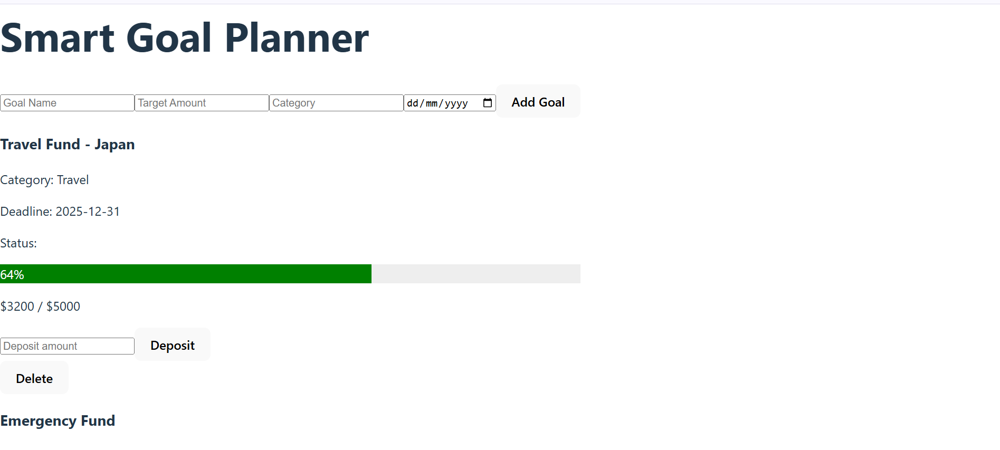

# Phase-2 Week-2 Code Challenge - SGP

A simple web app to help you create, view, and track your personal savings goals.

Available at: **https://smart-goal-planner-puce.vercel.app/**

By **Cassy Omondi**

## Screenshot



## Features

- View all your financial goals in a clean layout
- Add new goals with details like target, deadline, and category
- Edit or delete existing goals
- Track progress with deposits
- Responsive and clean UI


## How to Use

### View Live Site

Visit the deployed application at: **https://smart-goal-planner-puce.vercel.app/**

The backend JSON is already live at: https://smart-goal-server.onrender.com/goals

You can:

- Add goals (POST)

- View & fetch goals (GET)

- Edit goals (PATCH)

- Delete goals (DELETE)

- Deposit to a goal (PATCH)

- Visual progress

- Goal status (due soon, overdue, complete)

- Overview (count, total saved, etc.)

### Local Development

If you'd like to run the project locally:

#### 1. Clone the repository:
```bash
git clone https://github.com/evansveryown/smart_goal_planner.git

Or download the ZIP and extract it.
```

#### 2. Navigate to the project folder:
```bash
cd smart_goal_planner
```

#### 3. Install Dependencies:
```bash
npm install
```

#### 4. Start the Development Server

```bash
npm run dev
```

 --- 
 
# Author

Cassy Omondi

# License

MIT License

Copyright © 2025 Cassy Omondi

Permission is hereby granted, free of charge, to any person obtaining a copy of this software and associated documentation files (the "Software"), to deal in the Software without restriction, including without limitation the rights to use, copy, modify, merge, publish, distribute, sublicense, and/or sell copies of the Software, and to permit persons to whom the Software is furnished to do so, subject to the following conditions:

The above copyright notice and this permission notice shall be included in all copies or substantial portions of the Software.

THE SOFTWARE IS PROVIDED "AS IS", WITHOUT WARRANTY OF ANY KIND, EXPRESS OR IMPLIED, INCLUDING BUT NOT LIMITED TO THE WARRANTIES OF MERCHANTABILITY, FITNESS FOR A PARTICULAR PURPOSE AND NONINFRINGEMENT. IN NO EVENT SHALL THE AUTHORS OR COPYRIGHT HOLDERS BE LIABLE FOR ANY CLAIM, DAMAGES OR OTHER LIABILITY, WHETHER IN AN ACTION OF CONTRACT, TORT OR OTHERWISE, ARISING FROM, OUT OF OR IN CONNECTION WITH THE SOFTWARE OR THE USE OR OTHER DEALINGS IN THE SOFTWARE.